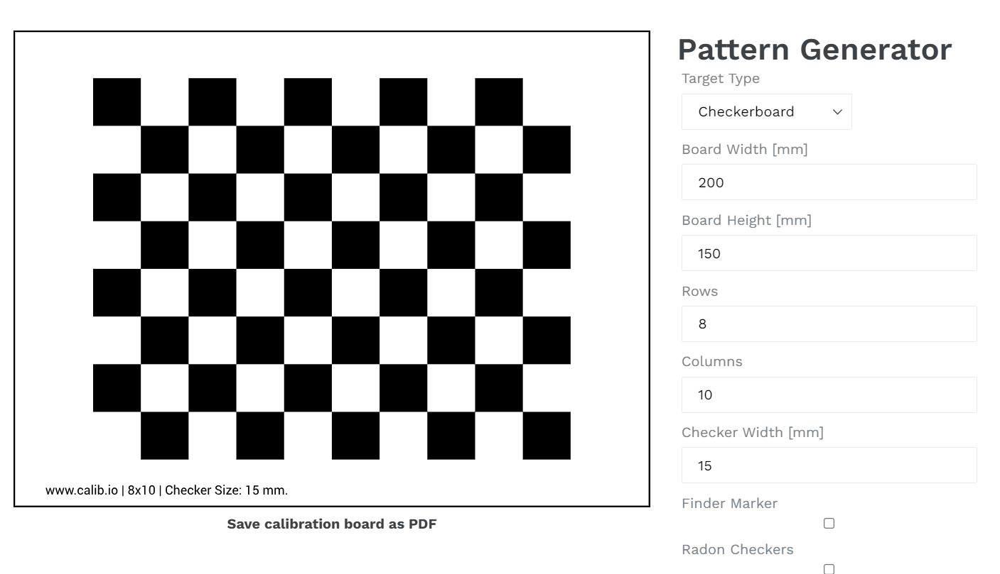
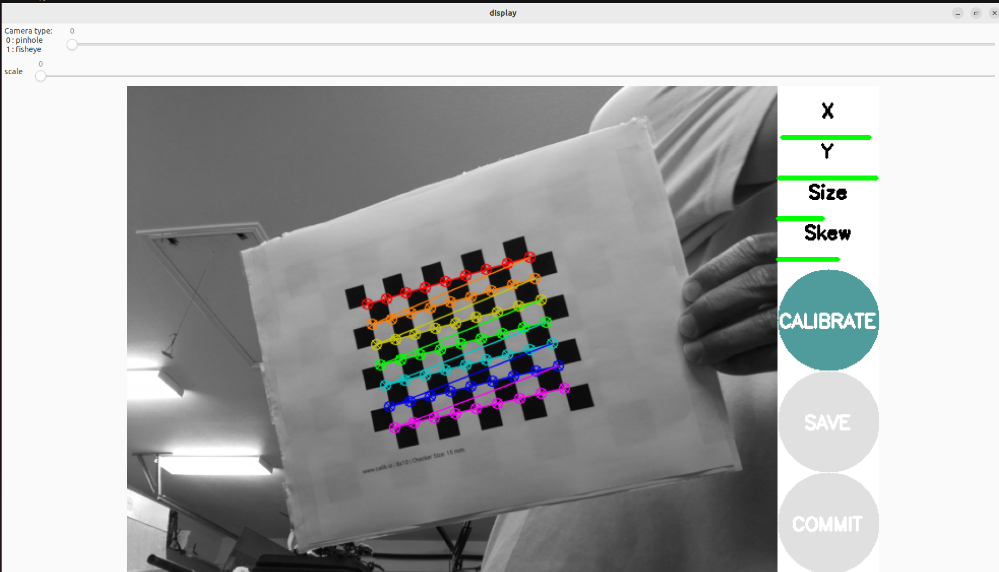
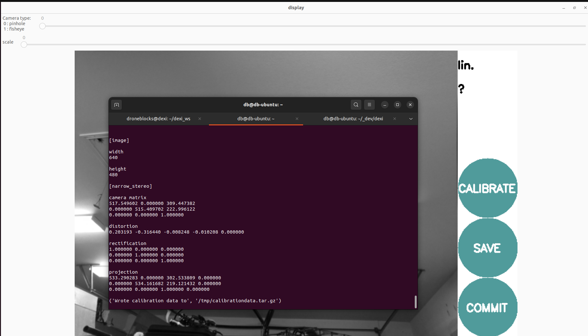

# Calibrating Pi Cam v2.1

Reference documentation for camera calibration:
- https://medium.com/starschema-blog/offline-camera-calibration-in-ros-2-45e81df12555
- https://navigation.ros.org/tutorials/docs/camera_calibration.html

Camera node should be run on Pi and Calibration GUI on a laptop/desktop. Make sure both have the same ROS_DOMAIN_ID set:

export ROS_DOMAIN_ID=1

## Checkerboard
Checkerboard can be [found here](./assets/calib.io_checker_200x150_8x10_15.pdf). Be sure when printing to print at 100% so your printer does not scale the image. Each checker should be 15x15mm as specified in the [pattern generator](https://calib.io/pages/camera-calibration-pattern-generator).



The size of this board is 7x9 (interior corners) with a square size of 0.015 (in meters). It's best to tape the checkerboard to cardboard or something rigid so the paper doesn't fold.

## Raspberry Pi Side

For Pi cam v2 and v2.1 make sure to have your pi /boot/firmware/config.txt properly set:

```
#camera_auto_detect=1
start_x=1
```

Then run:

```
ros2 run cv_camera cv_camera_node --ros-args -r __ns:=/camera
```

This is from: https://github.com/Kapernikov/cv_camera

The namespace of /camera is important so that on the laptop/desktop it finds the /camera/image_raw topic and we can do the calibration.

## Laptop side

```
sudo apt install ros-humble-camera-calibration
```

Now run:

```
ros2 run camera_calibration cameracalibrator --size 7x9 --square 0.015 --ros-args -r image:=/image_raw
```

Move your board around the camera and wait for all sliders to turn green as shown below.



Click calibrate and the intrinsic params will be printed to the console.



Click save and a calibrationdata.tar.gz will be saved to the /tmp folder on your desktop. The file that we want is ost.yaml, which has the calibration config.

Now run the camera node and you should a nice image with a good frame rate.

```
 ros2 run cv_camera cv_camera_node --ros-args -r __ns:=/camera -p camera_info_url:=file:///home/droneblocks/dexi_ws/src/dexi/camera_info/main_camera_2.1.yaml
 ```

 NOTE: we need to find the best place to put this file. The calibration should only need to be run once for all cameras of a certain type, in our case cam v2.1.

 When running the node you should hopefully see the param file loaded properly:

 ```
 [INFO] [1714425307.072069671] [camera.cv_camera]: camera calibration URL: file:///home/droneblocks/dexi_ws/src/dexi/camera_info/main_camera_2.1.yaml
 ```

 You can see the params being published at the following topic:

 ```
 ros2 topic echo /camera/camera_info
 ```

 and check out the frame rate:

 ```
 ros2 topic hz /camera/image_raw
 average rate: 30.135
        min: 0.028s max: 0.038s std dev: 0.00299s window: 31
average rate: 30.043
        min: 0.028s max: 0.038s std dev: 0.00306s window: 62
average rate: 30.019
        min: 0.028s max: 0.038s std dev: 0.00299s window: 92
average rate: 30.020
        min: 0.028s max: 0.038s std dev: 0.00288s window: 123
average rate: 30.025
        min: 0.028s max: 0.039s std dev: 0.00292s window: 154
average rate: 30.004
        min: 0.028s max: 0.039s std dev: 0.00284s window: 184
```


