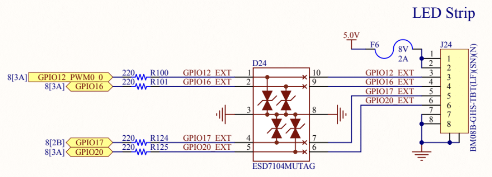
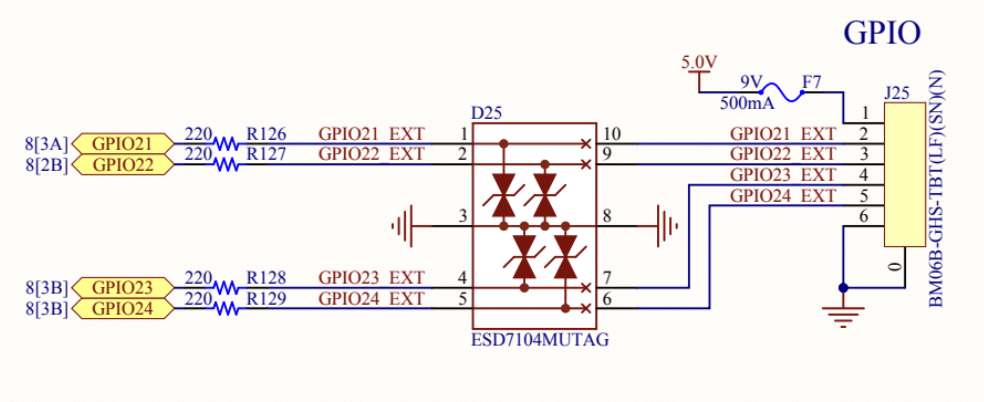
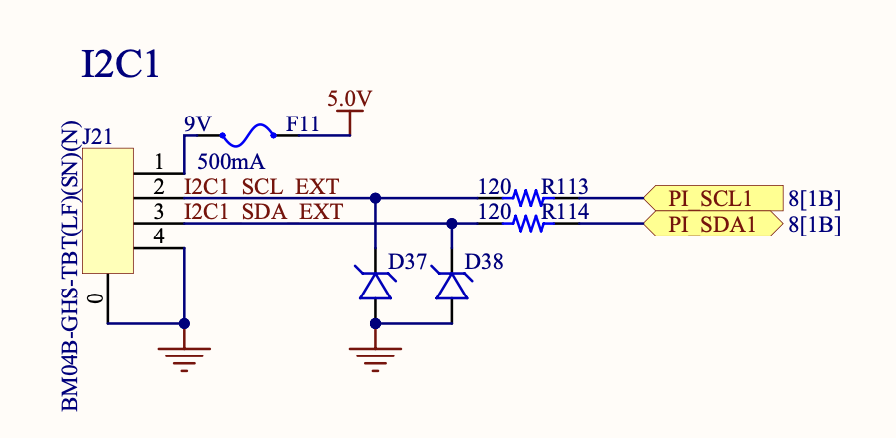
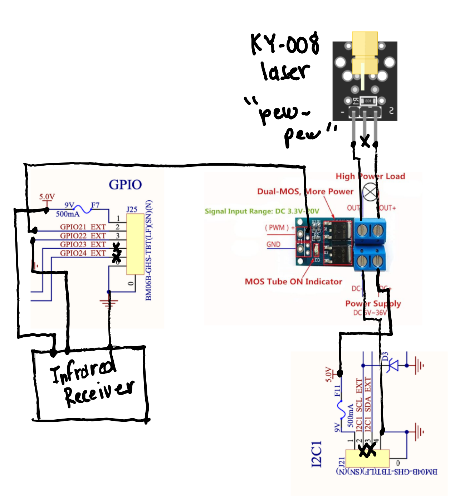

# GPIO

RPi.GPIO is part of DEXI-OS

## Overview

The GPIO pins currently available are 16, 17, 20, 21, 22, 23, and 24

Pin 12 is reserved for LED control







## Example wiring diagram for 2024 AVR Drone Competition (Laser and Infrared Receiver)

> Dennis apologizes for his kindergarten-level diagramming skills



## Launch

ros2 launch dexi_py gpio.launch.yaml

## Command Line Test

```
ros2 service call /dexi/gpio_writer_service/write_gpio_21 dexi_interfaces/srv/GPIOSend "{pin: 21, state: 1}"
```

# GPIO for AVR

AVR (Advanced Vertical Robotics) 2024 will require DEXI to have an infrared receiver, laser emitter, and April Tag detection via Pi Camera.

The recommended GPIO mapping is:

Laser = GPIO 21 (output)
IR Receiver = GPIO 22 (input)

# TODO: IGNORE BELOW

### Install

From here: https://abyz.me.uk/rpi/pigpio/download.html do the following:

```
cd
git clone https://github.com/joan2937/pigpio
cd pigpio
make
sudo make install
sudo pigpiod
```

### Run

In the dexi/droneblocks/python-examples folder run the test connected to GPIO 18:

```
python3 laser.py
```

## Service

```
sudo cp ~/ros2_ws/src/dexi/systemd/pigpiod.service /etc/systemd/system
sudo systemctl daemon-reload
sudo systemctl enable pigpiod.service
```
