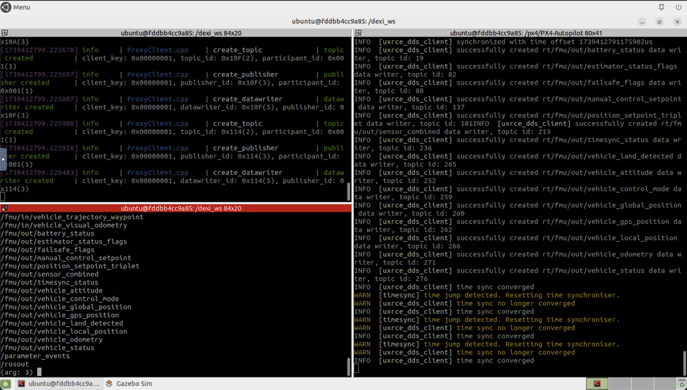

# PX4 Offboard Control

Please be sure to view the DroneBlocks course explaining how to use SITL for offboard control. It's important to understand how offboard control works before applying this to your real, flying DEXI!

## SITL First

Let's discuss how to get this running in SITL first. Make sure you have followed the [SITL setup doc](sitl.md).

## DEXI Workspace

Since you followed the SITL setup docs you will now have a ROS2 workspace mapped from your host machine inside the container. Open Terminator and change to the DEXI workspace with the following command:

```
cd ~/dexi_ws
```

## px4_msgs and dexi_interfaces

It's important to note that all PX4 ROS communication is done with px4_msgs. You can [learn about them here](https://github.com/PX4/px4_msgs). The short version is that px4_msgs expose ROS2 nodes for accessing PX4 internals.

dexi_interfaces is a package that has several message types and services specific to the DEXI drone. One example would be control of the LED ring.

Make sure you are still in the ~/dexi_ws directory and then you can build px4_msgs and dexi_interfaces with:

```
colcon build --packages-select px4_msgs dexi_interfaces
```

This may take a few minutes so please be patient. After the build is complete we need to "source" the workspace to access what we just built:

```
source ~/dexi_ws/install/setup.bash
```

You will need to run the command above every time you open a new terminal window and want to access DEXI ROS2 functionality. To simplify this step you can always add the command to your bash profile:

```
echo "source ~/dexi_ws/install/setup.bash" >> ~/.bashrc
```

**We HIGHLY recommend performing the step above. It will make development much easier!**

Now double-check one of the message types to make sure everything was built correctly:

```
ros2 interface show px4_msgs/msg/OffboardControlMode
```

## uXRCE DDS Agent

Now that PX4 messages have been built and activated we need to run the uXRCE DDS agent, which is available in the Docker container. To learn more about the agent [you can go here](https://docs.px4.io/main/en/middleware/uxrce_dds.html).

```
MicroXRCEAgent udp4 --port 8888
```

## Start PX4 SITL

Create a new Terminator window. You can right click in your existing window and split vertically or horizontally: whatever you prefer!

We will now start up PX4 SITL in this window:

```
cd /px4/PX4-Autopilot
```

and then:

```
make px4_sitl gz_x500
```

## ROS2 Topics based on px4_msgs

The MicroXRCEAgent will now connect to PX4 SITL and expose ROS2 topics for us! Let's take a look.

Open another another Terminal window and and run:

```
ros2 topic list
```

You will see the PX4/ROS2 topics printed to the screen. Your terminator will look something like the following.



Now let's subscribe to one of the topics and see data from PX4. Run the following command:

```
ros2 topic echo /fmu/out/vehicle_status
```

You will see data from PX4 SITL being printed to the screen. 

## Takeoff and Land Test

While the takeoff and land example doesn't make use off offboard control, it's still a great example of how to programmatically change into discrete flight modes such as Takeoff mode and Land mode.

Make sure PX4 SITL and the MicroXRCEAgent are running as previously discussed. Now open a new terminal (or use a previous terminal), make sure you've sourced your environment so that px4_msgs are loaded, and navigate to:

```
cd ~/dexi_ws/src/dexi_py/examples
```

and run:

```
python3 takeoff_and_land_modes.py
```

You can observe your drone takeoff, hover for 10 seconds 2m above ground, and land. Feel free to review amd modify the script to gain a better understanding of how flight modes can be triggered programmatically.

##
From the root of your ROS2 workspace:

```
colcon build --packages-select px4_msgs
colcon build --packages-select microxrcedds_agent
```

## Start

Make sure PX4 SITL is running on the host:

```
cd ~/PX4-Autopilot
make px4_sitl gz_x500
```

This should start the microdds client in SITL.

Now launch the offboard nodes:

```
source install/setup.bash
ros2 launch dexi_py offboard.launch.xml
```

## Command Line
```
ros2 topic pub /offboard/command std_msgs/String "data: 'arm'" -1
ros2 topic pub /offboard/command std_msgs/String "data: 'takeoff'" -1
ros2 topic pub /offboard/command std_msgs/String "data: 'land'" -1
ros2 topic pub /offboard/move std_msgs/Float32 "data: 1.0" -1
```
